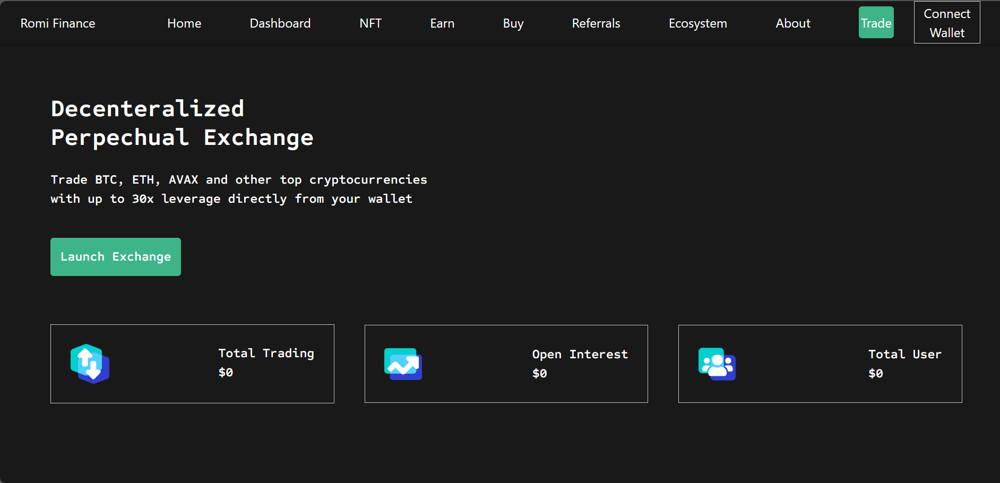
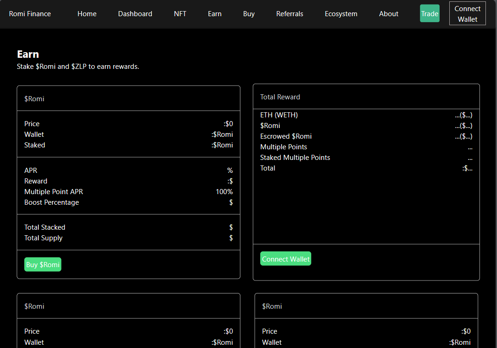

# Zomi Finance App Clone - React Frontend

Welcome to the Zomi Finance App Clone, a React-based web application that replicates the user interface of the Zomi Finance app. This readme file will provide you with information on how to set up and run the application, as well as a brief overview of its features and technologies used.






## Table of Contents

- [Prerequisites](#prerequisites)
- [Getting Started](#getting-started)
- [Folder Structure](#folder-structure)
- [Available Scripts](#available-scripts)
- [Technologies Used](#technologies-used)
- [Contributing](#contributing)
- [License](#license)

## Prerequisites

Before you can run the Zomi Finance App Clone, you need to ensure that you have the following prerequisites installed on your system:

- Node.js: Download and install Node.js from [https://nodejs.org/](https://nodejs.org/).

## Getting Started

1. Clone the repository to your local machine:

   ```
   git clone https://github.com/TheValour/Zomi_app.git
   ```

2. Navigate to the project directory:

   ```
   cd Zomi_app
   ```

3. Install the project dependencies using npm:

   ```
   npm install
   ```

4. Start the development server:

   ```
   npm start
   ```

5. Open your web browser and visit [http://localhost:3000](http://localhost:3000) to access the Zomi Finance App Clone.

## Folder Structure

The project structure is organized as follows:

- `src/`: Contains the source code for the application.
- `public/`: Contains the public assets and HTML template.
- `package.json`: Defines project dependencies and scripts.
- `README.md`: The readme file you are currently reading.

## Available Scripts

In the project directory, you can run the following scripts:

- `npm start`: Starts the development server for the app in development mode.
- `npm build`: Builds the app for production to the `build` folder.
- `npm test`: Launches the test runner in interactive watch mode.
- `npm eject`: This command will remove the single build dependency from your project.

## Technologies Used

The application is built using the following technologies:

- React: A JavaScript library for building user interfaces.
- React Router: For handling routing within the application.
- Axios: For making HTTP requests to interact with a backend API.
- TawilWind Css: For UI components and styling.

## Contributing

If you'd like to contribute to the project, please follow these steps:

1. Fork the repository.
2. Create a new branch for your feature or bug fix.
3. Make your changes and commit them.
4. Push your changes to your fork.
5. Create a pull request to the original repository.

## License

This project is licensed under the MIT License. Please see the [LICENSE](LICENSE) file for more details.

Feel free to reach out if you have any questions or need further assistance with the Zomi Finance App Clone. Happy coding!😍😍😍